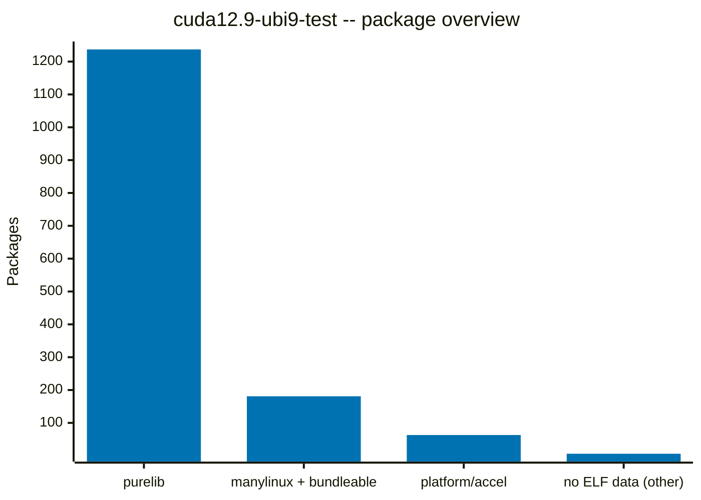

# ELF Analysis: cuda12.9-ubi9-test

## Summary

| Category | Count | % |
|:---|---:|---:|
| **Total packages** | **1487** |  |
| &ensp;Purelib (pure Python) | 1237 | 83.2% |
| &ensp;Platlib (native code) | 250 | 16.8% |
| &ensp;Manylinux + bundleable | 181 | 12.2% |
| &ensp;&ensp;Manylinux-only | 169 | 11.4% |
| &ensp;&ensp;Could be bundled | 9 | 0.6% |
| &ensp;&ensp;Pre-built (manylinux) | 3 | 0.2% |
| &ensp;Platform-dependent | 63 | 4.2% |
| &ensp;&ensp;Accelerator-specific | 19 | 1.3% |
| &ensp;&ensp;Unbundleable | 43 | 2.9% |
| &ensp;&ensp;Undecided | 1 | 0.1% |
| &ensp;&ensp;Unknown | 0 | 0.0% |
| &ensp;No ELF data (other) | 6 | 0.4% |
| **Purelib + manylinux + bundleable** | **1418** | **95.4%** |
| **Platform/accel + other** | **69** | **4.6%** |

## Charts

## External Dependencies

| Library | Count | Projects |
|:---|---:|:---|
| libcudart.so.12 | 18 | bitsandbytes, causal-conv1d, deep-ep, deep-gemm, detectron2, faiss-cpu, flash-attn, flashinfer-jit-cache, kvcached, mamba-ssm, nixl-cu12, onnxruntime-gpu, pplx-kernels, torchao, torchaudio, torchcodec, torchvision, vllm |
| libtorch_cpu.so | 13 | causal-conv1d, deep-ep, deep-gemm, detectron2, flash-attn, kvcached, mamba-ssm, pplx-kernels, torchao, torchaudio, torchcodec, torchvision, vllm |
| libc10.so | 11 | causal-conv1d, deep-ep, deep-gemm, detectron2, flash-attn, kvcached, mamba-ssm, pplx-kernels, torchcodec, torchvision, vllm |
| libc10_cuda.so | 10 | causal-conv1d, deep-ep, deep-gemm, detectron2, flash-attn, mamba-ssm, pplx-kernels, torchcodec, torchvision, vllm |
| libgomp.so.1 | 8 | bitsandbytes, faiss-cpu, lightgbm, numba, scikit-learn, scikit-network, simsimd, xgboost |
| libtorch_cuda.so | 8 | deep-gemm, flash-attn, pplx-kernels, torchao, torchaudio, torchcodec, torchvision, vllm |
| libtorch_python.so | 8 | causal-conv1d, deep-ep, deep-gemm, detectron2, flash-attn, kvcached, mamba-ssm, vllm |
| libcrypto.so.3 | 7 | cmake, cryptography, grpcio, pyarrow, pymssql, sccache, yara-python |
| libbz2.so.1 | 6 | daft, pyarrow, python-libsbml, selenium, uv, uv-build |
| libssl.so.3 | 6 | cmake, cryptography, grpcio, pyarrow, pymssql, sccache |
| libcuda.so.1 | 5 | flashinfer-jit-cache, kvcached, pplx-kernels, pyarrow, vllm |
| libjpeg.so.62 | 5 | docling-parse, opencv-python, opencv-python-headless, pillow, torchvision |
| libavcodec.so.60 | 4 | av, opencv-python, opencv-python-headless, torchcodec |
| libavformat.so.60 | 4 | av, opencv-python, opencv-python-headless, torchcodec |
| libavutil.so.58 | 4 | av, opencv-python, opencv-python-headless, torchcodec |
| libcublas.so.12 | 4 | bitsandbytes, faiss-cpu, flashinfer-jit-cache, onnxruntime-gpu |
| libcublasLt.so.12 | 4 | bitsandbytes, faiss-cpu, flashinfer-jit-cache, onnxruntime-gpu |
| libnvrtc.so.12 | 4 | deep-gemm, flashinfer-jit-cache, torchcodec, vllm |
| libopenblasp.so.0 | 4 | numpy, opencv-python, opencv-python-headless, scipy |
| libopenjp2.so.7 | 4 | docling-parse, opencv-python, opencv-python-headless, pillow |
| libre2.so.9 | 4 | grpcio, onnxruntime, onnxruntime-gpu, pyarrow |
| libswscale.so.7 | 4 | av, opencv-python, opencv-python-headless, torchcodec |
| libwebp.so.7 | 4 | opencv-python, opencv-python-headless, pillow, torchvision |
| libavdevice.so.60 | 3 | av, opencv-python, torchcodec |
| libfreetype.so.6 | 3 | docling-parse, matplotlib, pillow |
| liblz4.so.1 | 3 | lz4, memray, pyarrow |
| libpng16.so.16 | 3 | opencv-python, opencv-python-headless, torchvision |
| libtiff.so.5 | 3 | opencv-python, opencv-python-headless, pillow |
| libtorch.so | 3 | pplx-kernels, torchcodec, vllm |
| libwebpdemux.so.2 | 3 | opencv-python, opencv-python-headless, pillow |
| libwebpmux.so.3 | 3 | opencv-python, opencv-python-headless, pillow |
| libavfilter.so.9 | 2 | av, torchcodec |
| libffi.so.8 | 2 | cffi, pandoc-rhai |
| libgdal.so.36 | 2 | pyogrio, rasterio |
| libgssapi_krb5.so.2 | 2 | gssapi, pymssql |
| liblcms2.so.2 | 2 | docling-parse, pillow |
| libmariadb.so.3 | 2 | mariadb, mysqlclient |
| libnvshmem_host.so.3 | 2 | deep-ep, pplx-kernels |
| libswresample.so.4 | 2 | av, torchcodec |
| libtinfo.so.6 | 2 | cmake, llvmlite |
| libunwind.so.8 | 2 | memray, ray |
| libzstd.so.1 | 2 | llvmlite, pyarrow |
| libaio.so.1 | 1 | nixl-cu12 |
| libcudnn.so.9 | 1 | onnxruntime-gpu |
| libcufft.so.11 | 1 | onnxruntime-gpu |
| libcufile.so.0 | 1 | nixl-cu12 |
| libcurand.so.10 | 1 | onnxruntime-gpu |
| libcurl.so.4 | 1 | pyarrow |
| libcusparse.so.12 | 1 | bitsandbytes |
| libdebuginfod.so.1 | 1 | memray |
| libeccodes.so.0.1 | 1 | pygrib |
| libev.so.4 | 1 | cassandra-driver |
| libexslt.so.0 | 1 | lxml |
| libgeos_c.so.1 | 1 | shapely |
| libgfortran.so.5 | 1 | scipy |
| libgmp.so.10 | 1 | pandoc-rhai |
| libhdf5.so.310 | 1 | h5py |
| libhdf5_hl.so.310 | 1 | h5py |
| libicui18n.so.67 | 1 | apsw |
| libicuuc.so.67 | 1 | apsw |
| libk5crypto.so.3 | 1 | krb5 |
| libkrb5.so.3 | 1 | krb5 |
| liblept.so.5 | 1 | tesserocr |
| libloguru.so.2 | 1 | docling-parse |
| liblzma.so.5 | 1 | uv-build |
| libnccl.so.2 | 1 | deep-ep |
| libncurses.so.6 | 1 | cmake |
| libnetcdf.so.19 | 1 | netcdf4 |
| libnppicc.so.12 | 1 | torchcodec |
| libnvJitLink.so.12 | 1 | bitsandbytes |
| libnvjpeg.so.12 | 1 | torchvision |
| libodbc.so.2 | 1 | pyodbc |
| libopenblaso.so.0 | 1 | faiss-cpu |
| libpq.so.5 | 1 | psycopg2 |
| libproj.so.25 | 1 | pyproj |
| libpython3.12.so.1.0 | 1 | torchcodec |
| libqhull_r.so.7 | 1 | matplotlib |
| libsnappy.so.1 | 1 | pyarrow |
| libtbb.so.2 | 1 | prophet |
| libtesseract.so.4 | 1 | tesserocr |
| libthrift-0.15.0.so | 1 | pyarrow |
| libucp.so.0 | 1 | nixl-cu12 |
| libucs.so.0 | 1 | nixl-cu12 |
| libutf8proc.so.2 | 1 | pyarrow |
| libxml2.so.2 | 1 | lxml |
| libxslt.so.1 | 1 | lxml |
| libz3.so | 1 | tilelang |
| libzip.so.5 | 1 | tacozip |
| libzmq.so.5 | 1 | pyzmq |

89 unique libraries across 242 project references

## Inter-wheel Dependencies

| Library | Provided by | Required by |
|:---|:---|:---|
| libtvm_ffi.so | apache-tvm-ffi | tilelang, xgrammar |
| libz3.so.4.15 | z3-solver | tilelang |

2 shared libraries provided by wheels and used by other wheels

## Dependency Complexity

### Manylinux-only (169 packages)

These packages only depend on manylinux baseline libraries
and/or libraries provided by other wheels in the index.

aiohttp, aiokafka, annoy, apache-tvm-ffi, argon2-cffi-bindings, array-record, ast-serialize, asyncmy, asyncpg, backports-zstd, base2048, bcrypt, biotite, biotraj, blake3, blis, brotli, cachebox, caio, cbor2, cftime, chromadb, clickhouse-connect, cmarkgfm, contourpy, coverage, cuda-bindings, cuda-tile, cymem, cysignals, cython, debugpy, dm-tree, duckdb, eval-hub-server, fastar, fastavro, fastsafetensors, fasttext-predict, fastuuid, frozenlist, gevent, geventhttpclient, goodpoints, google-re2, greenlet, grpcio-tools, hf-transfer, hf-xet, hiredis, hnswlib, httptools, jiter, jpype1, kernels-data, kiwisolver, kornia-rs, lancedb, lapx, lazy-object-proxy, libcst, librt, lintrunner, llguidance, markupsafe, maturin, minify-html, ml-dtypes, mmh3, msgpack, msgspec, multidict, murmurhash, nh3, numcodecs, numexpr, nvidia-cudnn-frontend, nvtx, obstore, onnx, openai-harmony, openalgo, openshell, optree, oracledb, orjson, ormsgpack, outlines-core, pandas, patchelf, peewee, pendulum, phik, pinecone, polars, posix-ipc, preshed, propcache, protobuf, psutil, py-rust-stemmers, py-spy, pyasn, pybase64, pyclipper, pycocotools, pycrdt, pycryptodome, pycryptodomex, pydantic-core, pydantic-monty, pydantic-monty-runtime, pymongo, pynacl, pysqlite3, python-rapidjson, pytokens, pywavelets, pyzstd, rapidfuzz, regex, rfc3161-client, rignore, ripgrep, river, rpds-py, ruff, safetensors, scikit-image, sentencepiece, setproctitle, shap, snowflake-connector-python, soxr, spacy, sqlalchemy, srsly, statsmodels, stringzilla, temporalio, tensordict, tensorflow, thinc, thriftpy2, tiktoken, tlparse, tokenizers, tornado, tree-sitter, tree-sitter-c, tree-sitter-javascript, tree-sitter-languages, tree-sitter-python, tree-sitter-typescript, triton, ujson, uuid-utils, uvloop, wandb, watchfiles, websockets, wordcloud, wrapt, xgrammar, xxhash, yarl, z3-solver, zope-interface, zstandard

### Could become manylinux by bundling (9 packages)

All external deps are vendorable -- bundling them would make
these wheels manylinux-compatible.

| Package | Libraries |
|:---|:---|
| cassandra-driver | libev.so.4 |
| mariadb | libmariadb.so.3 |
| mysqlclient | libmariadb.so.3 |
| onnxruntime | libre2.so.9 |
| prophet | libtbb.so.2 |
| psycopg2 | libpq.so.5 |
| pygrib | libeccodes.so.0.1 |
| pyzmq | libzmq.so.5 |
| tacozip | libzip.so.5 |

### AI accelerator-specific (19 packages)

Depend on CUDA, ROCm, or PyTorch runtime libraries.
These must be provided by the accelerator platform.

| Package | Additional libraries |
|:---|:---|
| bitsandbytes | libcublas.so.12, libcublasLt.so.12, libcudart.so.12, libcusparse.so.12, libgomp.so.1, libnvJitLink.so.12 |
| causal-conv1d | libc10.so, libc10_cuda.so, libcudart.so.12, libtorch_cpu.so, libtorch_python.so |
| deep-ep | libc10.so, libc10_cuda.so, libcudart.so.12, libnccl.so.2, libnvshmem_host.so.3, libtorch_cpu.so, libtorch_python.so |
| deep-gemm | libc10.so, libc10_cuda.so, libcudart.so.12, libnvrtc.so.12, libtorch_cpu.so, libtorch_cuda.so, libtorch_python.so |
| detectron2 | libc10.so, libc10_cuda.so, libcudart.so.12, libtorch_cpu.so, libtorch_python.so |
| faiss-cpu | libcublas.so.12, libcublasLt.so.12, libcudart.so.12, libgomp.so.1, libopenblaso.so.0 |
| flash-attn | libc10.so, libc10_cuda.so, libcudart.so.12, libtorch_cpu.so, libtorch_cuda.so, libtorch_python.so |
| flashinfer-jit-cache | libcublas.so.12, libcublasLt.so.12, libcuda.so.1, libcudart.so.12, libnvrtc.so.12 |
| kvcached | libc10.so, libcuda.so.1, libcudart.so.12, libtorch_cpu.so, libtorch_python.so |
| mamba-ssm | libc10.so, libc10_cuda.so, libcudart.so.12, libtorch_cpu.so, libtorch_python.so |
| nixl-cu12 | libaio.so.1, libcudart.so.12, libcufile.so.0, libucp.so.0, libucs.so.0 |
| onnxruntime-gpu | libcublas.so.12, libcublasLt.so.12, libcudart.so.12, libcudnn.so.9, libcufft.so.11, libcurand.so.10, libre2.so.9 |
| pplx-kernels | libc10.so, libc10_cuda.so, libcuda.so.1, libcudart.so.12, libnvshmem_host.so.3, libtorch.so, libtorch_cpu.so, libtorch_cuda.so |
| pyarrow | libbz2.so.1, libcrypto.so.3, libcuda.so.1, libcurl.so.4, liblz4.so.1, libre2.so.9, libsnappy.so.1, libssl.so.3, libthrift-0.15.0.so, libutf8proc.so.2, libzstd.so.1 |
| torchao | libcudart.so.12, libtorch_cpu.so, libtorch_cuda.so |
| torchaudio | libcudart.so.12, libtorch_cpu.so, libtorch_cuda.so |
| torchcodec | libavcodec.so.60, libavdevice.so.60, libavfilter.so.9, libavformat.so.60, libavutil.so.58, libc10.so, libc10_cuda.so, libcudart.so.12, libnppicc.so.12, libnvrtc.so.12, libpython3.12.so.1.0, libswresample.so.4, libswscale.so.7, libtorch.so, libtorch_cpu.so, libtorch_cuda.so |
| torchvision | libc10.so, libc10_cuda.so, libcudart.so.12, libjpeg.so.62, libnvjpeg.so.12, libpng16.so.16, libtorch_cpu.so, libtorch_cuda.so, libwebp.so.7 |
| vllm | libc10.so, libc10_cuda.so, libcuda.so.1, libcudart.so.12, libnvrtc.so.12, libtorch.so, libtorch_cpu.so, libtorch_cuda.so, libtorch_python.so |

### Unbundleable external dependencies (43 packages)

At least one external dep must never be bundled (crypto,
system runtime, etc.) and must be provided by the platform.
This includes indirect dependencies (e.g. libmariadb depends
on OpenSSL, libpq depends on OpenSSL + Kerberos).

| Package | Libraries |
|:---|:---|
| apsw | libicui18n.so.67, libicuuc.so.67 |
| av | libavcodec.so.60, libavdevice.so.60, libavfilter.so.9, libavformat.so.60, libavutil.so.58, libswresample.so.4, libswscale.so.7 |
| cffi | libffi.so.8 |
| cmake | libcrypto.so.3, libncurses.so.6, libssl.so.3, libtinfo.so.6 |
| cryptography | libcrypto.so.3, libssl.so.3 |
| daft | libbz2.so.1 |
| docling-parse | libfreetype.so.6, libjpeg.so.62, liblcms2.so.2, libopenjp2.so.7 (+ libloguru.so.2) |
| grpcio | libcrypto.so.3, libssl.so.3 (+ libre2.so.9) |
| gssapi | libgssapi_krb5.so.2 |
| h5py | libhdf5.so.310, libhdf5_hl.so.310 |
| krb5 | libk5crypto.so.3, libkrb5.so.3 |
| lightgbm | libgomp.so.1 |
| llvmlite | libtinfo.so.6, libzstd.so.1 |
| lxml | libexslt.so.0, libxml2.so.2, libxslt.so.1 |
| lz4 | liblz4.so.1 |
| matplotlib | libfreetype.so.6 (+ libqhull_r.so.7) |
| memray | libdebuginfod.so.1, liblz4.so.1, libunwind.so.8 |
| netcdf4 | libnetcdf.so.19 |
| numba | libgomp.so.1 |
| numpy | libopenblasp.so.0 |
| opencv-python | libavcodec.so.60, libavdevice.so.60, libavformat.so.60, libavutil.so.58, libjpeg.so.62, libopenblasp.so.0, libopenjp2.so.7, libpng16.so.16, libswscale.so.7, libtiff.so.5, libwebp.so.7, libwebpdemux.so.2, libwebpmux.so.3 |
| opencv-python-headless | libavcodec.so.60, libavformat.so.60, libavutil.so.58, libjpeg.so.62, libopenblasp.so.0, libopenjp2.so.7, libpng16.so.16, libswscale.so.7, libtiff.so.5, libwebp.so.7, libwebpdemux.so.2, libwebpmux.so.3 |
| pandoc-rhai | libffi.so.8, libgmp.so.10 |
| pillow | libfreetype.so.6, libjpeg.so.62, liblcms2.so.2, libopenjp2.so.7, libtiff.so.5, libwebp.so.7, libwebpdemux.so.2, libwebpmux.so.3 |
| pymssql | libcrypto.so.3, libgssapi_krb5.so.2, libssl.so.3 |
| pyodbc | libodbc.so.2 |
| pyogrio | libgdal.so.36 |
| pyproj | libproj.so.25 |
| python-libsbml | libbz2.so.1 |
| rasterio | libgdal.so.36 |
| ray | libunwind.so.8 |
| sccache | libcrypto.so.3, libssl.so.3 |
| scikit-learn | libgomp.so.1 |
| scikit-network | libgomp.so.1 |
| scipy | libgfortran.so.5, libopenblasp.so.0 |
| selenium | libbz2.so.1 |
| shapely | libgeos_c.so.1 |
| simsimd | libgomp.so.1 |
| tesserocr | liblept.so.5, libtesseract.so.4 |
| uv | libbz2.so.1 |
| uv-build | libbz2.so.1, liblzma.so.5 |
| xgboost | libgomp.so.1 |
| yara-python | libcrypto.so.3 |

### Undecided external dependencies (1 packages)

All external deps are known but not yet classified as
bundleable or unbundleable.

| Package | Libraries |
|:---|:---|
| tilelang | libz3.so |

**Total:** 241 packages with ELF dependencies (169 manylinux-only, 9 bundleable, 19 accelerator, 43 unbundleable, 1 undecided, 0 unknown)

## Packages without ELF Data (9)

Platlib packages that ship platform-specific wheels but have no
fromager-elf-requires/provides metadata. These are typically
pre-built upstream wheels, proprietary binary blobs, packages
with optional C extensions, or packages built without fromager
instrumentation.

**Pre-built manylinux (3):** nvidia-cutlass-dsl-libs-base, runai-model-streamer, soundfile

**Other (6):** dulwich, frozendict, mysql-connector-python, pyyaml, rtree, torch

