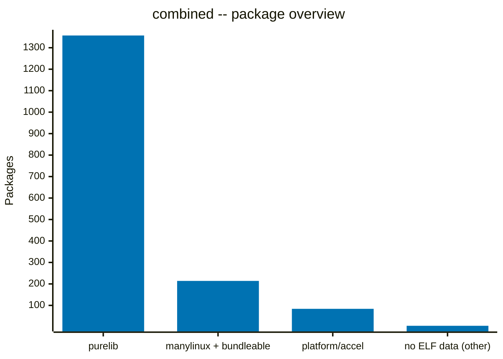

# ELF Analysis: combined

## Summary

| Category | Count | % |
|:---|---:|---:|
| **Total packages** | **1657** |  |
| &ensp;Purelib (pure Python) | 1357 | 81.9% |
| &ensp;Platlib (native code) | 300 | 18.1% |
| &ensp;Manylinux + bundleable | 214 | 12.9% |
| &ensp;&ensp;Manylinux-only | 195 | 11.8% |
| &ensp;&ensp;Could be bundled | 13 | 0.8% |
| &ensp;&ensp;Pre-built (manylinux) | 6 | 0.4% |
| &ensp;Platform-dependent | 84 | 5.1% |
| &ensp;&ensp;Accelerator-specific | 31 | 1.9% |
| &ensp;&ensp;Unbundleable | 52 | 3.1% |
| &ensp;&ensp;Undecided | 0 | 0.0% |
| &ensp;&ensp;Unknown | 1 | 0.1% |
| &ensp;No ELF data (other) | 5 | 0.3% |
| **Purelib + manylinux + bundleable** | **1571** | **94.8%** |
| **Platform/accel + other** | **86** | **5.2%** |

## Charts

## External Dependencies

| Library | Count | Projects |
|:---|---:|:---|
| libcudart.so.13 | 19 | bitsandbytes, causal-conv1d, deep-ep, deep-gemm, detectron2, faiss-cpu, flash-attn, flashinfer-jit-cache, kvcached, mamba-ssm, nixl-cu13, onnxruntime-gpu, pplx-kernels, torchao, torchaudio, torchcodec, torchvision, vllm, xformers |
| libcudart.so.12 | 18 | bitsandbytes, causal-conv1d, deep-ep, deep-gemm, detectron2, faiss-cpu, flash-attn, flashinfer-jit-cache, kvcached, mamba-ssm, nixl-cu12, onnxruntime-gpu, pplx-kernels, torchao, torchaudio, torchcodec, torchvision, vllm |
| libcrypto.so.3 | 13 | c2pa-python, cmake, cryptography, grpcio, maturin, pyarrow, pymssql, ray-haproxy, rfc3161-client, runai-model-streamer-azure, runai-model-streamer-s3, sccache, yara-python |
| libgomp.so.1 | 12 | bitsandbytes, ctranslate2, faiss-cpu, lightgbm, numba, pennylane-lightning, scikit-learn, scikit-network, simsimd, torch, xgboost, zentorch |
| libssl.so.3 | 12 | c2pa-python, cmake, cryptography, grpcio, maturin, pyarrow, pymssql, ray-haproxy, rfc3161-client, runai-model-streamer-azure, runai-model-streamer-s3, sccache |
| libamdhip64.so.7 | 10 | amd-aiter, aotriton, ctranslate2, detectron2, flash-attn, flydsl, tensorflow-rocm, torch, torchvision, vllm |
| libc10_cuda.so | 10 | causal-conv1d, deep-ep, deep-gemm, detectron2, flash-attn, mamba-ssm, pplx-kernels, torchcodec, torchvision, vllm |
| libtorch_cuda.so | 9 | deep-gemm, flash-attn, pplx-kernels, torchao, torchaudio, torchcodec, torchvision, vllm, xformers |
| libbz2.so.1 | 6 | daft, pyarrow, python-libsbml, selenium, uv, uv-build |
| libjpeg.so.62 | 6 | docling-parse, opencv-python, opencv-python-headless, pillow, torchcodec, torchvision |
| libopenblasp.so.0 | 6 | numpy, opencv-python, opencv-python-headless, scipy, scs, sparsediffpy |
| libcublas.so.13 | 5 | bitsandbytes, cupy-cuda13x, faiss-cpu, flashinfer-jit-cache, onnxruntime-gpu |
| libcuda.so.1 | 5 | flashinfer-jit-cache, kvcached, pplx-kernels, pyarrow, vllm |
| libnvrtc.so.13 | 5 | cupy-cuda13x, deep-gemm, flashinfer-jit-cache, torchcodec, vllm |
| libre2.so.9 | 5 | grpcio, onnxruntime, onnxruntime-gpu, onnxruntime-migraphx, pyarrow |
| libavcodec.so.60 | 4 | av, opencv-python, opencv-python-headless, torchcodec |
| libavformat.so.60 | 4 | av, opencv-python, opencv-python-headless, torchcodec |
| libavutil.so.58 | 4 | av, opencv-python, opencv-python-headless, torchcodec |
| libcublas.so.12 | 4 | bitsandbytes, faiss-cpu, flashinfer-jit-cache, onnxruntime-gpu |
| libcublasLt.so.12 | 4 | bitsandbytes, faiss-cpu, flashinfer-jit-cache, onnxruntime-gpu |
| libcublasLt.so.13 | 4 | bitsandbytes, faiss-cpu, flashinfer-jit-cache, onnxruntime-gpu |
| libhipblas.so.3 | 4 | bitsandbytes, ctranslate2, torch, vllm |
| liblzma.so.5 | 4 | aotriton, maturin, torch, uv-build |
| libnvrtc.so.12 | 4 | deep-gemm, flashinfer-jit-cache, torchcodec, vllm |
| libopenjp2.so.7 | 4 | docling-parse, opencv-python, opencv-python-headless, pillow |
| libpng16.so.16 | 4 | opencv-python, opencv-python-headless, torchcodec, torchvision |
| librocrand.so.1 | 4 | bitsandbytes, torch, torchcodec, vllm |
| libswscale.so.7 | 4 | av, opencv-python, opencv-python-headless, torchcodec |
| libwebp.so.7 | 4 | opencv-python, opencv-python-headless, pillow, torchvision |
| libavdevice.so.60 | 3 | av, opencv-python, torchcodec |
| libcurl.so.4 | 3 | pyarrow, runai-model-streamer-azure, runai-model-streamer-s3 |
| libfreetype.so.6 | 3 | docling-parse, matplotlib, pillow |
| libhiprand.so.1 | 3 | bitsandbytes, ctranslate2, torch |
| libhsa-runtime64.so.1 | 3 | tensorflow-rocm, tilelang, torch |
| liblz4.so.1 | 3 | lz4, memray, pyarrow |
| libnuma.so.1 | 3 | tensorflow-rocm, torch, vllm |
| libopenblaso.so.0 | 3 | ctranslate2, faiss-cpu, torch |
| libpq.so.5 | 3 | psycopg-c, psycopg2, psycopg2-binary |
| librocm_smi64.so.1 | 3 | tensorflow-rocm, torch, vllm |
| librocsolver.so.0 | 3 | tensorflow-rocm, torch, torchcodec |
| libtiff.so.5 | 3 | opencv-python, opencv-python-headless, pillow |
| libwebpdemux.so.2 | 3 | opencv-python, opencv-python-headless, pillow |
| libwebpmux.so.3 | 3 | opencv-python, opencv-python-headless, pillow |
| libaio.so.1 | 2 | nixl-cu12, nixl-cu13 |
| libavfilter.so.9 | 2 | av, torchcodec |
| libcufft.so.12 | 2 | cupy-cuda13x, onnxruntime-gpu |
| libcufile.so.0 | 2 | nixl-cu12, nixl-cu13 |
| libcurand.so.10 | 2 | cupy-cuda13x, onnxruntime-gpu |
| libffi.so.8 | 2 | cffi, pandoc-rhai |
| libgdal.so.36 | 2 | pyogrio, rasterio |
| libgssapi_krb5.so.2 | 2 | gssapi, pymssql |
| libhipblaslt.so.1 | 2 | bitsandbytes, torch |
| libhipfft.so.0 | 2 | tensorflow-rocm, torch |
| libhipsolver.so.1 | 2 | tensorflow-rocm, torch |
| libhipsparse.so.4 | 2 | tensorflow-rocm, torch |
| libhipsparselt.so.0 | 2 | tensorflow-rocm, torch |
| liblcms2.so.2 | 2 | docling-parse, pillow |
| libmariadb.so.3 | 2 | mariadb, mysqlclient |
| libnccl.so.2 | 2 | cupy-cuda13x, deep-ep |
| libnvjpeg.so.12 | 2 | torchcodec, torchvision |
| libnvjpeg.so.13 | 2 | torchcodec, torchvision |
| libnvshmem_host.so.3 | 2 | deep-ep, pplx-kernels |
| librccl.so.1 | 2 | tensorflow-rocm, torch |
| libsnappy.so.1 | 2 | openvino, pyarrow |
| libswresample.so.4 | 2 | av, torchcodec |
| libtbb.so.2 | 2 | openvino, prophet |
| libtinfo.so.6 | 2 | cmake, llvmlite |
| libucp.so.0 | 2 | nixl-cu12, nixl-cu13 |
| libucs.so.0 | 2 | nixl-cu12, nixl-cu13 |
| libunwind.so.8 | 2 | memray, ray |
| libxml2.so.2 | 2 | lxml, runai-model-streamer-azure |
| libzstd.so.1 | 2 | llvmlite, pyarrow |
| libMIOpen.so.1 | 1 | torch |
| libamd_comgr.so.3 | 1 | tensorflow-rocm |
| libcrypt.so.2 | 1 | ray-haproxy |
| libcudnn.so.9 | 1 | onnxruntime-gpu |
| libcufft.so.11 | 1 | onnxruntime-gpu |
| libcusolver.so.12 | 1 | cupy-cuda13x |
| libcusparse.so.12 | 1 | cupy-cuda13x |
| libcusparseLt.so.0 | 1 | cupy-cuda13x |
| libdebuginfod.so.1 | 1 | memray |
| libeccodes.so.0.1 | 1 | pygrib |
| libev.so.4 | 1 | cassandra-driver |
| libexslt.so.0 | 1 | lxml |
| libgeos_c.so.1 | 1 | shapely |
| libgfortran.so.5 | 1 | scipy |
| libgmp.so.10 | 1 | pandoc-rhai |
| libhdf5.so.310 | 1 | h5py |
| libhdf5_hl.so.310 | 1 | h5py |
| libhipfftw.so.0 | 1 | tensorflow-rocm |
| libhiprtc.so.7 | 1 | torch |
| libk5crypto.so.3 | 1 | krb5 |
| libkrb5.so.3 | 1 | krb5 |
| liblept.so.5 | 1 | tesserocr |
| libloguru.so.2 | 1 | docling-parse |
| libmpi.so.40 | 1 | torch |
| libmpi_cxx.so.40 | 1 | torch |
| libncurses.so.6 | 1 | cmake |
| libnetcdf.so.19 | 1 | netcdf4 |
| libodbc.so.2 | 1 | pyodbc |
| libomp.so | 1 | ctranslate2 |
| libpcre2-8.so.0 | 1 | ray-haproxy |
| libpcre2-posix.so.3 | 1 | ray-haproxy |
| libproj.so.25 | 1 | pyproj |
| libqhull_r.so.7 | 1 | matplotlib |
| librocblas.so.5 | 1 | torch |
| librocprofiler-register.so.0 | 1 | tensorflow-rocm |
| librocprofiler-sdk.so.1 | 1 | torch |
| libroctx64.so.4 | 1 | torch |
| libtesseract.so.4 | 1 | tesserocr |
| libthrift-0.15.0.so | 1 | pyarrow |
| libthrift-0.24.0.so | 1 | pyarrow |
| libutf8proc.so.2 | 1 | pyarrow |
| libuuid.so.1 | 1 | coremltools |
| libxslt.so.1 | 1 | lxml |
| libyaml-0.so.2 | 1 | pyyaml |
| libz3.so | 1 | tilelang |
| libzip.so.5 | 1 | tacozip |
| libzmq.so.5 | 1 | pyzmq |

119 unique libraries across 344 project references

## Inter-wheel Dependencies

| Library | Provided by | Required by |
|:---|:---|:---|
| libc10.so | torch | amd-aiter, amd-quark, causal-conv1d, deep-ep, deep-gemm, detectron2, flash-attn, kvcached, mamba-ssm, pplx-kernels, torchao, torchaudio, torchcodec, torchvision, vllm, zentorch |
| libc10_hip.so | torch | amd-aiter, detectron2, flash-attn, torchao, torchvision, vllm |
| libtorch.so | torch | amd-aiter, detectron2, pplx-kernels, torchcodec, vllm, zentorch |
| libtorch_cpu.so | torch | amd-aiter, amd-quark, causal-conv1d, deep-ep, deep-gemm, detectron2, flash-attn, kvcached, mamba-ssm, pplx-kernels, torchao, torchaudio, torchcodec, torchvision, vllm, xformers, zentorch |
| libtorch_hip.so | torch | amd-aiter, flash-attn, torchao, torchcodec, torchvision, vllm |
| libtorch_python.so | torch | amd-aiter, causal-conv1d, deep-ep, deep-gemm, detectron2, flash-attn, kvcached, mamba-ssm, vllm, zentorch |
| libtvm_ffi.so | apache-tvm-ffi | tilelang, xgrammar |
| libz3.so.4.15 | z3-solver | tilelang |

8 shared libraries provided by wheels and used by other wheels

## Dependency Complexity

### Manylinux-only (195 packages)

These packages only depend on manylinux baseline libraries
and/or libraries provided by other wheels in the index.

aiohttp, aiokafka, annoy, apache-tvm-ffi, argon2-cffi-bindings, array-record, ast-serialize, asyncmy, asyncpg, backports-zstd, base2048, bcrypt, biotite, biotraj, blake3, blis, brotli, cachebox, caio, cartopy, cbor2, cftime, chromadb, clarabel, clickhouse-connect, cmarkgfm, contourpy, coreforecast, coverage, cuda-bindings, cuda-core, cuda-tile, cvxpy, cymem, cysignals, cython, debugpy, dm-tree, duckdb, dumb-init, eval-hub-server, fastar, fastavro, fastsafetensors, fasttext-predict, fastuuid, frozenlist, gevent, geventhttpclient, goodpoints, google-re2, greenlet, grpcio-tools, hf-transfer, hf-xet, highspy, hiredis, hnswlib, httptools, instanttensor, jaxlib, jiter, jpype1, jsonnet, jsonpath-rust-bindings, kernels, kernels-data, kiwisolver, kornia-rs, lancedb, lapx, lazy-object-proxy, libcst, librt, lintrunner, llguidance, markupsafe, minify-html, ml-dtypes, mmh3, modelexpress, msgpack, msgspec, multidict, murmurhash, nccl4py, nh3, numcodecs, numexpr, nvidia-cudnn-frontend, nvtx, obstore, onnx, onnxsim, openai-harmony, openalgo, openshell, optree, oracledb, orjson, ormsgpack, osqp, outlines-core, pandas, patchelf, peewee, pendulum, phik, pinecone, polars, polyleven, posix-ipc, preshed, propcache, protobuf, psutil, pulp, py-rust-stemmers, py-spy, pybase64, pyclipper, pycocotools, pycrdt, pycryptodome, pycryptodomex, pydantic-core, pydantic-monty, pydantic-monty-client, pydantic-monty-runtime, pymongo, pynacl, pysqlite3, python-rapidjson, pytokens, pywavelets, pyzstd, qdldl, rapidfuzz, regex, rignore, ripgrep, river, rpds-py, ruff, runai-model-streamer, runai-model-streamer-gcs, rustworkx, safetensors, scikit-image, sentencepiece, setproctitle, shap, simplejson, snowflake-connector-python, soxr, spacy, speechrecognition, sqlalchemy, srsly, statsforecast, statsmodels, stringzilla, tensorboard-data-server, tensordict, tensorflow, tensorflow-cpu, tensorstore, thinc, thriftpy2, tiktoken, tlparse, tokenizers, tornado, tree-sitter, tree-sitter-c, tree-sitter-javascript, tree-sitter-languages, tree-sitter-python, tree-sitter-typescript, triton, ujson, uuid-utils, uvloop, wandb, watchfiles, wcwidth, websockets, wordcloud, wrapt, xgrammar, xxhash, yarl, z3-solver, zope-interface, zstandard

### Could become manylinux by bundling (13 packages)

All external deps are vendorable -- bundling them would make
these wheels manylinux-compatible.

| Package | Libraries |
|:---|:---|
| cassandra-driver | libev.so.4 |
| mariadb | libmariadb.so.3 |
| mysqlclient | libmariadb.so.3 |
| onnxruntime | libre2.so.9 |
| onnxruntime-migraphx | libre2.so.9 |
| prophet | libtbb.so.2 |
| psycopg-c | libpq.so.5 |
| psycopg2 | libpq.so.5 |
| psycopg2-binary | libpq.so.5 |
| pygrib | libeccodes.so.0.1 |
| pyyaml | libyaml-0.so.2 |
| pyzmq | libzmq.so.5 |
| tacozip | libzip.so.5 |

### AI accelerator-specific (31 packages)

Depend on CUDA, ROCm, or PyTorch runtime libraries.
These must be provided by the accelerator platform.

| Package | Additional libraries |
|:---|:---|
| amd-aiter | libamdhip64.so.7 |
| amd-quark |  |
| aotriton | libamdhip64.so.7, liblzma.so.5 |
| bitsandbytes | libcublas.so.12, libcublas.so.13, libcublasLt.so.12, libcublasLt.so.13, libcudart.so.12, libcudart.so.13, libgomp.so.1, libhipblas.so.3, libhipblaslt.so.1, libhiprand.so.1, librocrand.so.1 |
| causal-conv1d | libc10_cuda.so, libcudart.so.12, libcudart.so.13 |
| ctranslate2 | libamdhip64.so.7, libgomp.so.1, libhipblas.so.3, libhiprand.so.1, libomp.so, libopenblaso.so.0 |
| cupy-cuda13x | libcublas.so.13, libcufft.so.12, libcurand.so.10, libcusolver.so.12, libcusparse.so.12, libcusparseLt.so.0, libnccl.so.2, libnvrtc.so.13 |
| deep-ep | libc10_cuda.so, libcudart.so.12, libcudart.so.13, libnccl.so.2, libnvshmem_host.so.3 |
| deep-gemm | libc10_cuda.so, libcudart.so.12, libcudart.so.13, libnvrtc.so.12, libnvrtc.so.13, libtorch_cuda.so |
| detectron2 | libamdhip64.so.7, libc10_cuda.so, libcudart.so.12, libcudart.so.13 |
| faiss-cpu | libcublas.so.12, libcublas.so.13, libcublasLt.so.12, libcublasLt.so.13, libcudart.so.12, libcudart.so.13, libgomp.so.1, libopenblaso.so.0 |
| flash-attn | libamdhip64.so.7, libc10_cuda.so, libcudart.so.12, libcudart.so.13, libtorch_cuda.so |
| flashinfer-jit-cache | libcublas.so.12, libcublas.so.13, libcublasLt.so.12, libcublasLt.so.13, libcuda.so.1, libcudart.so.12, libcudart.so.13, libnvrtc.so.12, libnvrtc.so.13 |
| flydsl | libamdhip64.so.7 |
| kvcached | libcuda.so.1, libcudart.so.12, libcudart.so.13 |
| mamba-ssm | libc10_cuda.so, libcudart.so.12, libcudart.so.13 |
| nixl-cu12 | libaio.so.1, libcudart.so.12, libcufile.so.0, libucp.so.0, libucs.so.0 |
| nixl-cu13 | libaio.so.1, libcudart.so.13, libcufile.so.0, libucp.so.0, libucs.so.0 |
| onnxruntime-gpu | libcublas.so.12, libcublas.so.13, libcublasLt.so.12, libcublasLt.so.13, libcudart.so.12, libcudart.so.13, libcudnn.so.9, libcufft.so.11, libcufft.so.12, libcurand.so.10, libre2.so.9 |
| pplx-kernels | libc10_cuda.so, libcuda.so.1, libcudart.so.12, libcudart.so.13, libnvshmem_host.so.3, libtorch_cuda.so |
| pyarrow | libbz2.so.1, libcrypto.so.3, libcuda.so.1, libcurl.so.4, liblz4.so.1, libre2.so.9, libsnappy.so.1, libssl.so.3, libthrift-0.15.0.so, libthrift-0.24.0.so, libutf8proc.so.2, libzstd.so.1 |
| tensorflow-rocm | libamd_comgr.so.3, libamdhip64.so.7, libhipfft.so.0, libhipfftw.so.0, libhipsolver.so.1, libhipsparse.so.4, libhipsparselt.so.0, libhsa-runtime64.so.1, libnuma.so.1, librccl.so.1, librocm_smi64.so.1, librocprofiler-register.so.0, librocsolver.so.0 |
| tilelang | libhsa-runtime64.so.1, libz3.so |
| torch | libMIOpen.so.1, libamdhip64.so.7, libgomp.so.1, libhipblas.so.3, libhipblaslt.so.1, libhipfft.so.0, libhiprand.so.1, libhiprtc.so.7, libhipsolver.so.1, libhipsparse.so.4, libhipsparselt.so.0, libhsa-runtime64.so.1, liblzma.so.5, libmpi.so.40, libmpi_cxx.so.40, libnuma.so.1, libopenblaso.so.0, librccl.so.1, librocblas.so.5, librocm_smi64.so.1, librocprofiler-sdk.so.1, librocrand.so.1, librocsolver.so.0, libroctx64.so.4 |
| torchao | libcudart.so.12, libcudart.so.13, libtorch_cuda.so |
| torchaudio | libcudart.so.12, libcudart.so.13, libtorch_cuda.so |
| torchcodec | libavcodec.so.60, libavdevice.so.60, libavfilter.so.9, libavformat.so.60, libavutil.so.58, libc10_cuda.so, libcudart.so.12, libcudart.so.13, libjpeg.so.62, libnvjpeg.so.12, libnvjpeg.so.13, libnvrtc.so.12, libnvrtc.so.13, libpng16.so.16, librocrand.so.1, librocsolver.so.0, libswresample.so.4, libswscale.so.7, libtorch_cuda.so |
| torchvision | libamdhip64.so.7, libc10_cuda.so, libcudart.so.12, libcudart.so.13, libjpeg.so.62, libnvjpeg.so.12, libnvjpeg.so.13, libpng16.so.16, libtorch_cuda.so, libwebp.so.7 |
| vllm | libamdhip64.so.7, libc10_cuda.so, libcuda.so.1, libcudart.so.12, libcudart.so.13, libhipblas.so.3, libnuma.so.1, libnvrtc.so.12, libnvrtc.so.13, librocm_smi64.so.1, librocrand.so.1, libtorch_cuda.so |
| xformers | libcudart.so.13, libtorch_cuda.so |
| zentorch | libgomp.so.1 |

### Unbundleable external dependencies (52 packages)

At least one external dep must never be bundled (crypto,
system runtime, etc.) and must be provided by the platform.
This includes indirect dependencies (e.g. libmariadb depends
on OpenSSL, libpq depends on OpenSSL + Kerberos).

| Package | Libraries |
|:---|:---|
| av | libavcodec.so.60, libavdevice.so.60, libavfilter.so.9, libavformat.so.60, libavutil.so.58, libswresample.so.4, libswscale.so.7 |
| c2pa-python | libcrypto.so.3, libssl.so.3 |
| cffi | libffi.so.8 |
| cmake | libcrypto.so.3, libncurses.so.6, libssl.so.3, libtinfo.so.6 |
| cryptography | libcrypto.so.3, libssl.so.3 |
| daft | libbz2.so.1 |
| docling-parse | libfreetype.so.6, libjpeg.so.62, liblcms2.so.2, libopenjp2.so.7 (+ libloguru.so.2) |
| grpcio | libcrypto.so.3, libssl.so.3 (+ libre2.so.9) |
| gssapi | libgssapi_krb5.so.2 |
| h5py | libhdf5.so.310, libhdf5_hl.so.310 |
| krb5 | libk5crypto.so.3, libkrb5.so.3 |
| lightgbm | libgomp.so.1 |
| llvmlite | libtinfo.so.6, libzstd.so.1 |
| lxml | libexslt.so.0, libxml2.so.2, libxslt.so.1 |
| lz4 | liblz4.so.1 |
| matplotlib | libfreetype.so.6 (+ libqhull_r.so.7) |
| maturin | libcrypto.so.3, liblzma.so.5, libssl.so.3 |
| memray | libdebuginfod.so.1, liblz4.so.1, libunwind.so.8 |
| netcdf4 | libnetcdf.so.19 |
| numba | libgomp.so.1 |
| numpy | libopenblasp.so.0 |
| opencv-python | libavcodec.so.60, libavdevice.so.60, libavformat.so.60, libavutil.so.58, libjpeg.so.62, libopenblasp.so.0, libopenjp2.so.7, libpng16.so.16, libswscale.so.7, libtiff.so.5, libwebp.so.7, libwebpdemux.so.2, libwebpmux.so.3 |
| opencv-python-headless | libavcodec.so.60, libavformat.so.60, libavutil.so.58, libjpeg.so.62, libopenblasp.so.0, libopenjp2.so.7, libpng16.so.16, libswscale.so.7, libtiff.so.5, libwebp.so.7, libwebpdemux.so.2, libwebpmux.so.3 |
| openvino | libsnappy.so.1 (+ libtbb.so.2) |
| pandoc-rhai | libffi.so.8, libgmp.so.10 |
| pennylane-lightning | libgomp.so.1 |
| pillow | libfreetype.so.6, libjpeg.so.62, liblcms2.so.2, libopenjp2.so.7, libtiff.so.5, libwebp.so.7, libwebpdemux.so.2, libwebpmux.so.3 |
| pymssql | libcrypto.so.3, libgssapi_krb5.so.2, libssl.so.3 |
| pyodbc | libodbc.so.2 |
| pyogrio | libgdal.so.36 |
| pyproj | libproj.so.25 |
| python-libsbml | libbz2.so.1 |
| rasterio | libgdal.so.36 |
| ray | libunwind.so.8 |
| ray-haproxy | libcrypt.so.2, libcrypto.so.3, libssl.so.3 (+ libpcre2-8.so.0, libpcre2-posix.so.3) |
| rfc3161-client | libcrypto.so.3, libssl.so.3 |
| runai-model-streamer-azure | libcrypto.so.3, libcurl.so.4, libssl.so.3, libxml2.so.2 |
| runai-model-streamer-s3 | libcrypto.so.3, libcurl.so.4, libssl.so.3 |
| sccache | libcrypto.so.3, libssl.so.3 |
| scikit-learn | libgomp.so.1 |
| scikit-network | libgomp.so.1 |
| scipy | libgfortran.so.5, libopenblasp.so.0 |
| scs | libopenblasp.so.0 |
| selenium | libbz2.so.1 |
| shapely | libgeos_c.so.1 |
| simsimd | libgomp.so.1 |
| sparsediffpy | libopenblasp.so.0 |
| tesserocr | liblept.so.5, libtesseract.so.4 |
| uv | libbz2.so.1 |
| uv-build | libbz2.so.1, liblzma.so.5 |
| xgboost | libgomp.so.1 |
| yara-python | libcrypto.so.3 |

### Unknown external dependencies (1 packages)

External deps not present in any classification list.

| Package | Count | Libraries |
|:---|---:|:---|
| coremltools | 1 | libuuid.so.1 |

**Total:** 292 packages with ELF dependencies (195 manylinux-only, 13 bundleable, 31 accelerator, 52 unbundleable, 0 undecided, 1 unknown)

## Packages without ELF Data (11)

Platlib packages that ship platform-specific wheels but have no
fromager-elf-requires/provides metadata. These are typically
pre-built upstream wheels, proprietary binary blobs, packages
with optional C extensions, or packages built without fromager
instrumentation.

**Pre-built manylinux (6):** intel-cmplr-lib-ur, intel-openmp, nvidia-cutlass-dsl-libs-base, nvidia-cutlass-dsl-libs-cu12, nvidia-cutlass-dsl-libs-cu13, soundfile

**Other (5):** dulwich, frozendict, mysql-connector-python, rtree, torch-nnpa

