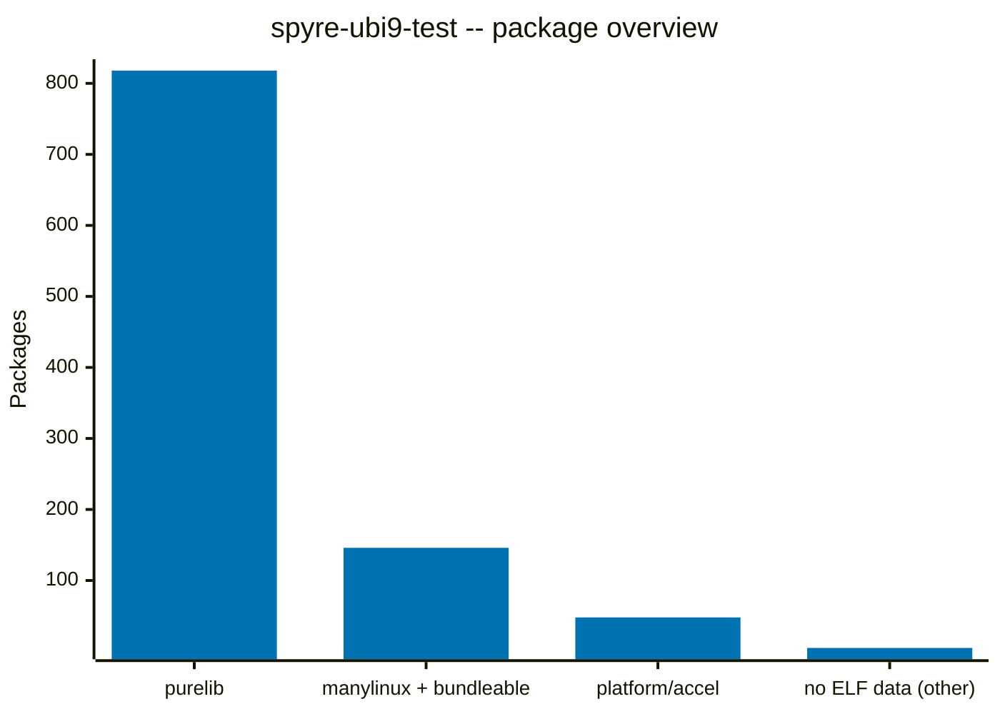

# ELF Analysis: spyre-ubi9-test

## Summary

| Category | Count | % |
|:---|---:|---:|
| **Total packages** | **1015** |  |
| &ensp;Purelib (pure Python) | 818 | 80.6% |
| &ensp;Platlib (native code) | 197 | 19.4% |
| &ensp;Manylinux + bundleable | 146 | 14.4% |
| &ensp;&ensp;Manylinux-only | 138 | 13.6% |
| &ensp;&ensp;Could be bundled | 6 | 0.6% |
| &ensp;&ensp;Pre-built (manylinux) | 2 | 0.2% |
| &ensp;Platform-dependent | 48 | 4.7% |
| &ensp;&ensp;Accelerator-specific | 2 | 0.2% |
| &ensp;&ensp;Unbundleable | 45 | 4.4% |
| &ensp;&ensp;Undecided | 0 | 0.0% |
| &ensp;&ensp;Unknown | 1 | 0.1% |
| &ensp;No ELF data (other) | 5 | 0.5% |
| **Purelib + manylinux + bundleable** | **964** | **95.0%** |
| **Platform/accel + other** | **51** | **5.0%** |

## Charts

## External Dependencies

| Library | Count | Projects |
|:---|---:|:---|
| libcrypto.so.3 | 11 | c2pa-python, cmake, cryptography, grpcio, maturin, pyarrow, rfc3161-client, runai-model-streamer-azure, runai-model-streamer-s3, sccache, yara-python |
| libssl.so.3 | 10 | c2pa-python, cmake, cryptography, grpcio, maturin, pyarrow, rfc3161-client, runai-model-streamer-azure, runai-model-streamer-s3, sccache |
| libgomp.so.1 | 9 | ctranslate2, faiss-cpu, lightgbm, numba, pennylane-lightning, scikit-learn, scikit-network, torch, xgboost |
| libopenblasp.so.0 | 6 | numpy, opencv-python, opencv-python-headless, scipy, scs, sparsediffpy |
| libjpeg.so.62 | 5 | docling-parse, opencv-python, opencv-python-headless, pillow, torchvision |
| libbz2.so.1 | 4 | daft, pyarrow, uv, uv-build |
| libopenjp2.so.7 | 4 | docling-parse, opencv-python, opencv-python-headless, pillow |
| libwebp.so.7 | 4 | opencv-python, opencv-python-headless, pillow, torchvision |
| libavcodec.so.60 | 3 | av, opencv-python, opencv-python-headless |
| libavformat.so.60 | 3 | av, opencv-python, opencv-python-headless |
| libavutil.so.58 | 3 | av, opencv-python, opencv-python-headless |
| libcurl.so.4 | 3 | pyarrow, runai-model-streamer-azure, runai-model-streamer-s3 |
| libfreetype.so.6 | 3 | docling-parse, matplotlib, pillow |
| libopenblaso.so.0 | 3 | ctranslate2, faiss-cpu, torch |
| libpng16.so.16 | 3 | opencv-python, opencv-python-headless, torchvision |
| libre2.so.9 | 3 | grpcio, onnxruntime, pyarrow |
| libswscale.so.7 | 3 | av, opencv-python, opencv-python-headless |
| libtiff.so.5 | 3 | opencv-python, opencv-python-headless, pillow |
| libwebpdemux.so.2 | 3 | opencv-python, opencv-python-headless, pillow |
| libwebpmux.so.3 | 3 | opencv-python, opencv-python-headless, pillow |
| libavdevice.so.60 | 2 | av, opencv-python |
| liblcms2.so.2 | 2 | docling-parse, pillow |
| liblz4.so.1 | 2 | lz4, pyarrow |
| liblzma.so.5 | 2 | maturin, uv-build |
| libxml2.so.2 | 2 | lxml, runai-model-streamer-azure |
| libzstd.so.1 | 2 | llvmlite, pyarrow |
| libavfilter.so.9 | 1 | av |
| libeccodes.so.0.1 | 1 | pygrib |
| libexslt.so.0 | 1 | lxml |
| libffi.so.8 | 1 | cffi |
| libgdal.so.36 | 1 | pyogrio |
| libgeos_c.so.1 | 1 | shapely |
| libgfortran.so.5 | 1 | scipy |
| libgssapi_krb5.so.2 | 1 | gssapi |
| libhdf5.so.310 | 1 | h5py |
| libhdf5_hl.so.310 | 1 | h5py |
| libk5crypto.so.3 | 1 | krb5 |
| libkrb5.so.3 | 1 | krb5 |
| libloguru.so.2 | 1 | docling-parse |
| libmariadb.so.3 | 1 | mariadb |
| libmpi.so.40 | 1 | torch |
| libmpi_cxx.so.40 | 1 | torch |
| libncurses.so.6 | 1 | cmake |
| libnetcdf.so.19 | 1 | netcdf4 |
| libnuma.so.1 | 1 | torch |
| libpq.so.5 | 1 | psycopg-c |
| libproj.so.25 | 1 | pyproj |
| libqhull_r.so.7 | 1 | matplotlib |
| libsnappy.so.1 | 1 | pyarrow |
| libswresample.so.4 | 1 | av |
| libtbb.so.2 | 1 | prophet |
| libthrift-0.15.0.so | 1 | pyarrow |
| libthrift-0.24.0.so | 1 | pyarrow |
| libtinfo.so.6 | 1 | cmake |
| libunwind.so.8 | 1 | ray |
| libutf8proc.so.2 | 1 | pyarrow |
| libuuid.so.1 | 1 | coremltools |
| libxslt.so.1 | 1 | lxml |
| libzmq.so.5 | 1 | pyzmq |

59 unique libraries across 134 project references

## Inter-wheel Dependencies

| Library | Provided by | Required by |
|:---|:---|:---|
| libc10.so | torch | torchvision |
| libtorch_cpu.so | torch | torchaudio, torchvision |
| libtvm_ffi.so | apache-tvm-ffi | xgrammar |

3 shared libraries provided by wheels and used by other wheels

## Dependency Complexity

### Manylinux-only (138 packages)

These packages only depend on manylinux baseline libraries
and/or libraries provided by other wheels in the index.

aiohttp, aiokafka, annoy, apache-tvm-ffi, argon2-cffi-bindings, ast-serialize, asyncmy, backports-zstd, blake3, blis, brotli, cachebox, cbor2, cftime, clarabel, contourpy, cvxpy, cymem, cython, debugpy, duckdb, dumb-init, eval-hub-server, fastar, fasttext-predict, fastuuid, frozenlist, gevent, geventhttpclient, goodpoints, greenlet, grpcio-tools, hf-xet, highspy, hiredis, httptools, instanttensor, jaxlib, jiter, jsonpath-rust-bindings, kiwisolver, libcst, librt, llguidance, markupsafe, minify-html, ml-dtypes, mmh3, modelexpress, msgpack, msgspec, multidict, murmurhash, nh3, numcodecs, numexpr, nvtx, obstore, onnx, onnxsim, openai-harmony, openshell, orjson, ormsgpack, osqp, outlines-core, pandas, patchelf, peewee, phik, polars, preshed, propcache, protobuf, psutil, py-rust-stemmers, py-spy, pybase64, pyclipper, pycocotools, pycryptodome, pycryptodomex, pydantic-core, pydantic-monty, pydantic-monty-client, pydantic-monty-runtime, pynacl, python-rapidjson, pytokens, pywavelets, qdldl, rapidfuzz, regex, rignore, rpds-py, ruff, runai-model-streamer, runai-model-streamer-gcs, rustworkx, safetensors, scikit-image, sentencepiece, setproctitle, simplejson, snowflake-connector-python, spacy, speechrecognition, sqlalchemy, srsly, statsmodels, tensorboard-data-server, tensordict, tensorstore, thinc, tiktoken, tokenizers, tornado, tree-sitter, tree-sitter-c, tree-sitter-javascript, tree-sitter-languages, tree-sitter-python, tree-sitter-typescript, triton, ujson, uuid-utils, uvloop, wandb, watchfiles, wcwidth, websockets, wordcloud, wrapt, xgrammar, xxhash, yarl, zope-interface, zstandard

### Could become manylinux by bundling (6 packages)

All external deps are vendorable -- bundling them would make
these wheels manylinux-compatible.

| Package | Libraries |
|:---|:---|
| mariadb | libmariadb.so.3 |
| onnxruntime | libre2.so.9 |
| prophet | libtbb.so.2 |
| psycopg-c | libpq.so.5 |
| pygrib | libeccodes.so.0.1 |
| pyzmq | libzmq.so.5 |

### AI accelerator-specific (2 packages)

Depend on CUDA, ROCm, or PyTorch runtime libraries.
These must be provided by the accelerator platform.

| Package | Additional libraries |
|:---|:---|
| torchaudio |  |
| torchvision | libjpeg.so.62, libpng16.so.16, libwebp.so.7 |

### Unbundleable external dependencies (45 packages)

At least one external dep must never be bundled (crypto,
system runtime, etc.) and must be provided by the platform.
This includes indirect dependencies (e.g. libmariadb depends
on OpenSSL, libpq depends on OpenSSL + Kerberos).

| Package | Libraries |
|:---|:---|
| av | libavcodec.so.60, libavdevice.so.60, libavfilter.so.9, libavformat.so.60, libavutil.so.58, libswresample.so.4, libswscale.so.7 |
| c2pa-python | libcrypto.so.3, libssl.so.3 |
| cffi | libffi.so.8 |
| cmake | libcrypto.so.3, libncurses.so.6, libssl.so.3, libtinfo.so.6 |
| cryptography | libcrypto.so.3, libssl.so.3 |
| ctranslate2 | libgomp.so.1, libopenblaso.so.0 |
| daft | libbz2.so.1 |
| docling-parse | libfreetype.so.6, libjpeg.so.62, liblcms2.so.2, libopenjp2.so.7 (+ libloguru.so.2) |
| faiss-cpu | libgomp.so.1, libopenblaso.so.0 |
| grpcio | libcrypto.so.3, libssl.so.3 (+ libre2.so.9) |
| gssapi | libgssapi_krb5.so.2 |
| h5py | libhdf5.so.310, libhdf5_hl.so.310 |
| krb5 | libk5crypto.so.3, libkrb5.so.3 |
| lightgbm | libgomp.so.1 |
| llvmlite | libzstd.so.1 |
| lxml | libexslt.so.0, libxml2.so.2, libxslt.so.1 |
| lz4 | liblz4.so.1 |
| matplotlib | libfreetype.so.6 (+ libqhull_r.so.7) |
| maturin | libcrypto.so.3, liblzma.so.5, libssl.so.3 |
| netcdf4 | libnetcdf.so.19 |
| numba | libgomp.so.1 |
| numpy | libopenblasp.so.0 |
| opencv-python | libavcodec.so.60, libavdevice.so.60, libavformat.so.60, libavutil.so.58, libjpeg.so.62, libopenblasp.so.0, libopenjp2.so.7, libpng16.so.16, libswscale.so.7, libtiff.so.5, libwebp.so.7, libwebpdemux.so.2, libwebpmux.so.3 |
| opencv-python-headless | libavcodec.so.60, libavformat.so.60, libavutil.so.58, libjpeg.so.62, libopenblasp.so.0, libopenjp2.so.7, libpng16.so.16, libswscale.so.7, libtiff.so.5, libwebp.so.7, libwebpdemux.so.2, libwebpmux.so.3 |
| pennylane-lightning | libgomp.so.1 |
| pillow | libfreetype.so.6, libjpeg.so.62, liblcms2.so.2, libopenjp2.so.7, libtiff.so.5, libwebp.so.7, libwebpdemux.so.2, libwebpmux.so.3 |
| pyarrow | libbz2.so.1, libcrypto.so.3, libcurl.so.4, liblz4.so.1, libsnappy.so.1, libssl.so.3, libzstd.so.1 (+ libre2.so.9, libthrift-0.15.0.so, libthrift-0.24.0.so, libutf8proc.so.2) |
| pyogrio | libgdal.so.36 |
| pyproj | libproj.so.25 |
| ray | libunwind.so.8 |
| rfc3161-client | libcrypto.so.3, libssl.so.3 |
| runai-model-streamer-azure | libcrypto.so.3, libcurl.so.4, libssl.so.3, libxml2.so.2 |
| runai-model-streamer-s3 | libcrypto.so.3, libcurl.so.4, libssl.so.3 |
| sccache | libcrypto.so.3, libssl.so.3 |
| scikit-learn | libgomp.so.1 |
| scikit-network | libgomp.so.1 |
| scipy | libgfortran.so.5, libopenblasp.so.0 |
| scs | libopenblasp.so.0 |
| shapely | libgeos_c.so.1 |
| sparsediffpy | libopenblasp.so.0 |
| torch | libgomp.so.1, libmpi.so.40, libmpi_cxx.so.40, libnuma.so.1, libopenblaso.so.0 |
| uv | libbz2.so.1 |
| uv-build | libbz2.so.1, liblzma.so.5 |
| xgboost | libgomp.so.1 |
| yara-python | libcrypto.so.3 |

### Unknown external dependencies (1 packages)

External deps not present in any classification list.

| Package | Count | Libraries |
|:---|---:|:---|
| coremltools | 1 | libuuid.so.1 |

**Total:** 192 packages with ELF dependencies (138 manylinux-only, 6 bundleable, 2 accelerator, 45 unbundleable, 0 undecided, 1 unknown)

## Packages without ELF Data (7)

Platlib packages that ship platform-specific wheels but have no
fromager-elf-requires/provides metadata. These are typically
pre-built upstream wheels, proprietary binary blobs, packages
with optional C extensions, or packages built without fromager
instrumentation.

**Pre-built manylinux (2):** intel-cmplr-lib-ur, intel-openmp

**Other (5):** dulwich, pyyaml, rtree, torch-nnpa, vllm

